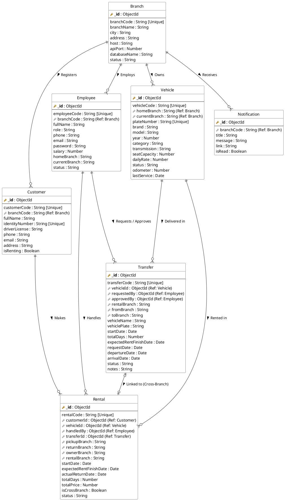

# Entity-Relationship Diagram (ERD) RentSync

Dokumen ini berisi rancangan relasi database MongoDB untuk sistem penyewaan kendaraan RentSync. Anda dapat membuat gambar diagram visualnya dengan menyalin kode PlantUML di bawah ini ke situs **[PlantText](https://www.planttext.com/)** atau **[PlantUML Web Server](https://www.plantuml.com/plantuml/uml/)**.

## 1. Kode PlantUML (Salin Kode Ini)

---

## 2. Penjelasan Relasi Antar-Koleksi (Collection)

Dalam lingkungan MongoDB (NoSQL) yang digunakan RentSync, relasi dibentuk dengan merujuk pada `ObjectId` ataupun `branchCode` antar dokumen. 

Berikut adalah rincian kardinalitas relasi antar-*collection*-nya:

### A. Branch (Cabang)
`Branch` adalah titik sentral dari arsitektur P2P RentSync. Cabang memiliki relasi **Satu-ke-Banyak (1:N)** dengan koleksi lainnya:
- **1 Branch punya N Customers**: Setiap *customer* akan diregistrasikan dan dicatat pertama kali di satu `branchCode` tertentu.
- **1 Branch punya N Employees**: Setiap karyawan ditempatkan di sebuah `branchCode`.
- **1 Branch punya N Vehicles**: Setiap mobil terikat secara *de jure* pada kepemilikan sebuah `homeBranch`.
- **1 Branch punya N Notifications**: Setiap lonceng/pesan notifikasi dari sistem akan dialamatkan secara spesifik ke kode cabang tertentu.

### B. Customer (Pelanggan)
- **1 Customer memiliki N Rentals (1:N)**: Seorang pelanggan dapat menyewa kendaraan berkali-kali. `Rental` akan mereferensikan `ObjectId` milik si pelanggan dalam kolom `customerId`.

### C. Employee (Pegawai / Admin)
- **1 Employee menangani N Rentals (1:N)**: Setiap tagihan/transaksi rental akan mencatat siapa *Admin* yang memproses (*checkout*) dokumen tersebut dalam kolom `handledBy`.
- **1 Employee mengajukan/menyetujui N Transfers (1:N)**: Tiket logistik *cross-branch* (`Transfer`) akan mencatat siapa Admin yang memintanya (`requestedBy`) dan siapa Admin dari cabang pemilik yang merestuinya (`approvedBy`).

### D. Vehicle (Kendaraan)
- **1 Vehicle terlibat dalam N Rentals (1:N)**: Sebuah kendaraan dipakai untuk banyak penyewaan historis. Relasi ini tertaut pada kolom `vehicleId` dalam `Rental`.
- **1 Vehicle terlibat dalam N Transfers (1:N)**: Sebuah kendaraan bisa dimutasi atau dikirim ke berbagai cabang dari waktu ke waktu. Relasi ini tertaut pada kolom `vehicleId` dalam `Transfer`.

### E. Rental & Transfer (Relasi 1:1 Bersyarat)
- **1 Rental terikat maksimal pada 1 Transfer (1:0..1)**:
  - Jika penyewaan bersifat **lokal** (cabang menyewakan mobilnya sendiri), maka `Rental` tidak akan memiliki *Transfer* (`transferId` kosong).
  - Namun, jika penyewaan bersifat **lintas cabang** (`isCrossBranch = true`), maka 1 dokumen `Rental` *WAJIB* dihubungkan langsung dengan 1 dokumen `Transfer` melalui tautan silang `transferId`. 
  - Relasi ini bersifat transaksional: perubahan status pada `Transfer` (seperti saat mobil *Arrived* atau *Rent Finished*) akan secara proaktif memengaruhi status tagihan di `Rental` yang terkait.
